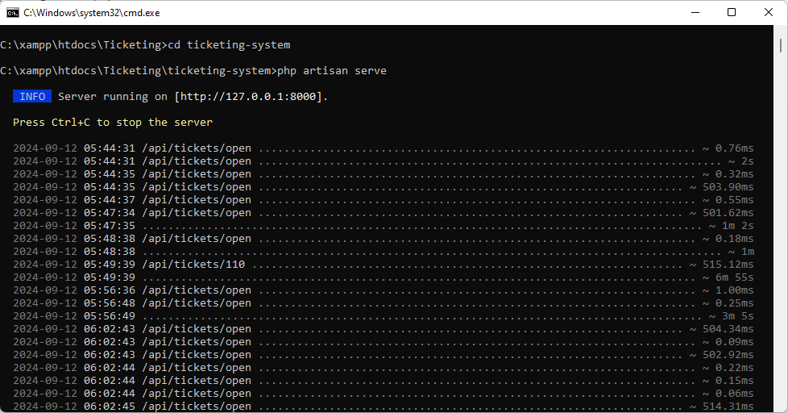
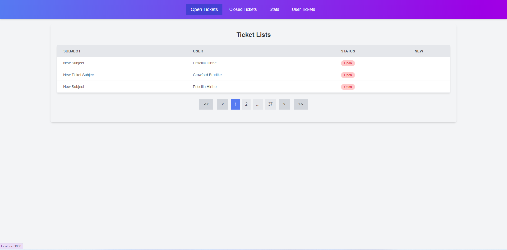
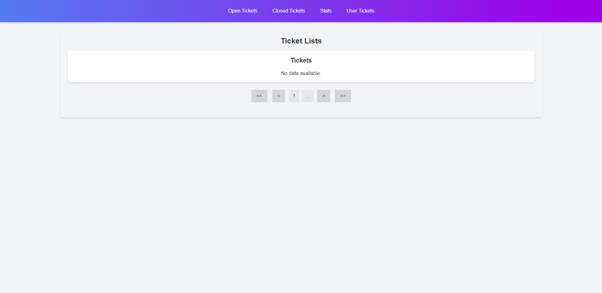
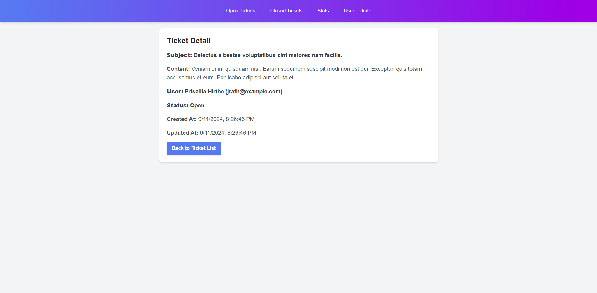
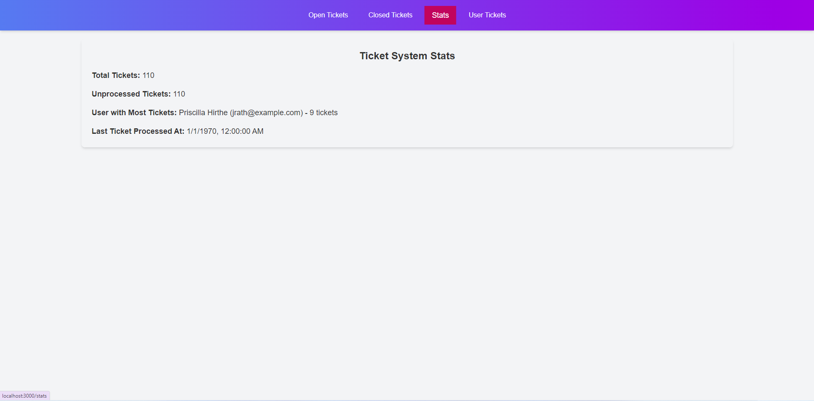
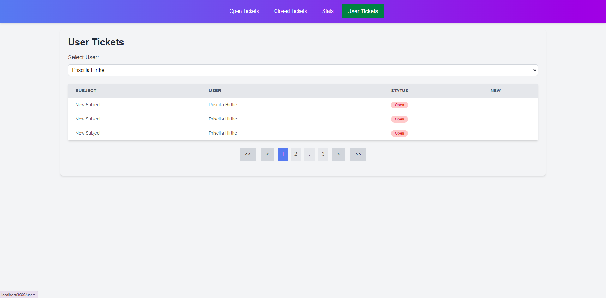
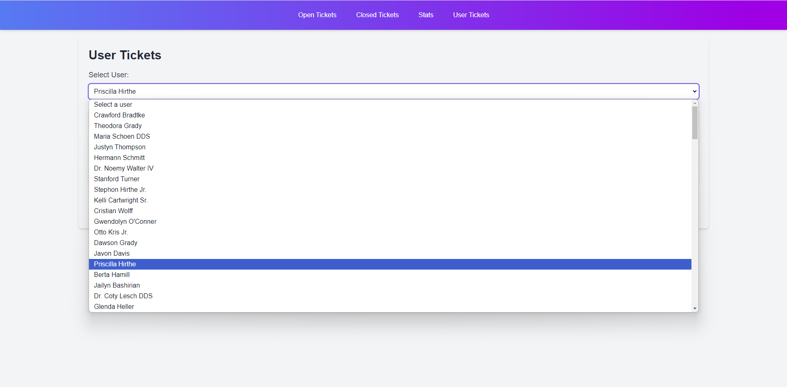
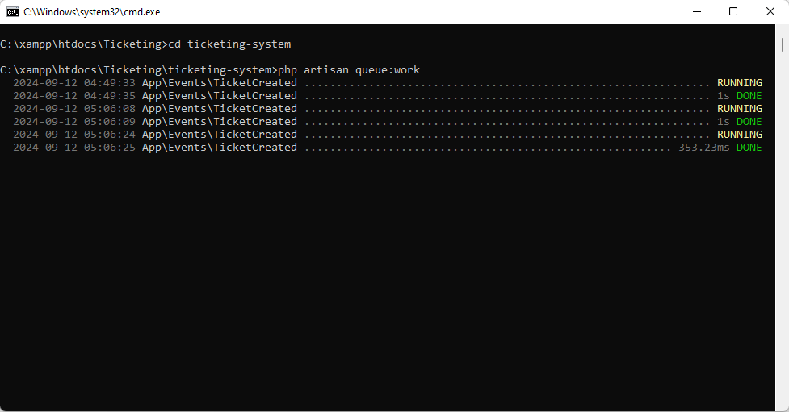
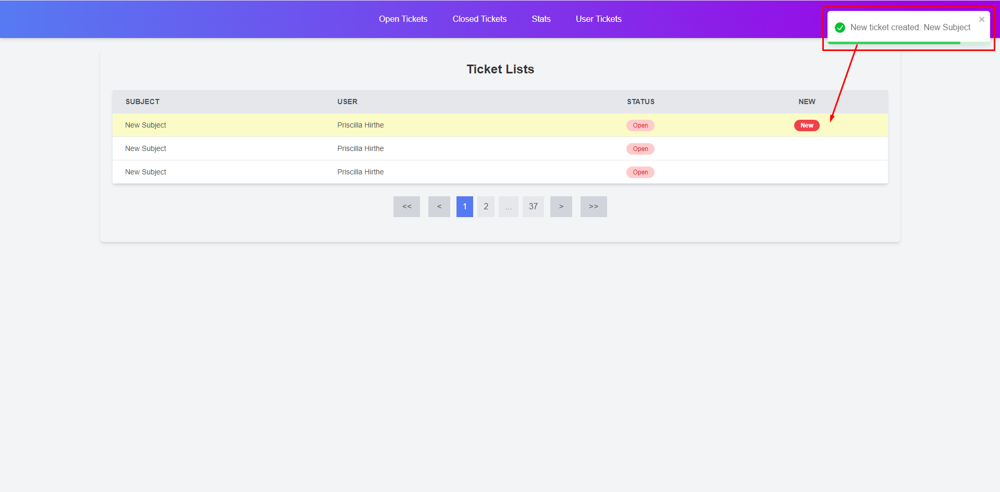

# Ticket Management System

This project is a **Ticket Management System** built with a Laravel backend and a React + Redux frontend.

## Table of Contents
- [Environment](#environment)
  - [Backend](#backend)
  - [Frontend](#frontend)
- [Project Setup](#project-setup)
  - [Backend (Laravel)](#backend-laravel)
  - [Frontend (React + Redux)](#frontend-react--redux)
- [Running the Project](#running-the-project)
  - [Running the Backend](#running-the-backend)
  - [Running the Frontend](#running-the-frontend)
- [Testing](#testing)
  - [Laravel Testing](#laravel-testing)
  - [Console Command Testing](#console-command-testing)

---

## Environment

### Backend

1. PHP Version

     Ensure you have PHP 8.0 or later installed. Laravel requires this to work properly.

2. Composer

     Composer is the dependency manager used for Laravel. Ensure it's installed:

### Frontend

1. Node Version

     Ensure you have Node 18 or later installed. Frontend requires this to work properly.

2. Package Manager

     You can use either npm or yarn as your package manager. Ensure it's installed:

3. Browser Compatibility

     The frontend is designed to work with modern browsers, including Chrome, Firefox, Edge, and Safari. Ensure you test it on these browsers to avoid any rendering issues.

## Project Setup

### Backend (Laravel)

Ensure you have PHP, Composer, and Laravel installed.

1. Clone the repository:

   ```bash
   git clone <repository-url>
   ```

2. Navigate to the backend directory:

   ```bash
   cd ticketing-system
   ```
3. Install the PHP dependencies using Composer:
   ```bash
   composer install
   ```
4. Create a `.env` file by copying the example:
   ```bash
   cp .env.example .env
   ```
5. Set up the database in `.env` and run the migrations:
   ```bash
   php artisan migrate
   ```

   ```
   You can double click `DB_migrate.bat` in the `Testing` Folder.
   ```
6. Seed the database:
   ```bash
   php artisan db:seed
   ```
7. Start the backend server:
   ```bash
   php artisan serve
   ```

   ```
   You can double click `Backend.bat` in the `Testing` Folder after setting `.env` file and composer installing.
   ```

   You should change `PUSHER_APP_ID`, `PUSHER_APP_KEY`, `PUSHER_APP_SECRET` and `PUSHER_APP_CLUSTER` to your own APP Information.

   

### Frontend (React + Redux)
Ensure you have Node.js and npm/yarn installed.

1. Navigate to the frontend directory:
   ```bash
   cd frontend
   ```

2. Install the dependencies:
   ```bash
   npm install
   ```
3. Create a `.env` file by copying the example:
   ```bash
   cp .env.example .env
   ```

   You should change `REACT_APP_PUSHER_APP_KEY` and `REACT_APP_PUSHER_APP_CLUSTER` to your own APP Information as the same as the backend env variable.
   
5. Start the development server:
   ```bash
   npm start
   ```
   
   You can double click `Frontend.bat` in the `Testing` Folder after setting `.env` file.

   

   

   

   

   

   


The frontend app will be available at `http://localhost:3000`

## Running the Project

### Running the Backend
To run the Laravel backend:
   ```bash
   php artisan serve
   ```
The backend will be available at `http://localhost:8000`.

### Running the Frontend

To run the React frontend:

   ```bash
   npm start
   ```
The frontend will be available at `http://localhost:3000`.

## Testing

### Laravel Testing
   You can test the Laravel Testing by running the following:
   ```bash
   php artisan test
   ```
   Then you can see the all of 9 tests are passed.

### Console Command Testing

   You can test the Laravel console commands by running the following:

   ```bash
   php artisan ticket:create "Subject" "Content" 1
   ```
   
   The last number is user_id. You should type user_id in the users table. If not, the error occurs.

   You can double click `ConsoleCommandTestEnv.bat` and then `ConsoleCommandTest.bat` in the `Testing` Folder. You must open `ConsoleCommandTestEnv.bat` before running `ConsoleCommandTest.bat` File.

   

   
